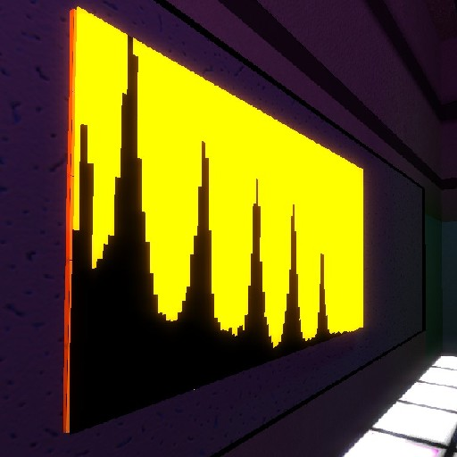

Virtual DJ Gamemode for Garry's Mod
=======================================

This is an add-on for Garry's Mod which introduces a new gamemode and a
few new entities for it as well. This game mode is designed for virtual
DJ sets and things like that.



Its primary intention is to be used in the creation of a virtual-club
environment (with multiple visualizers around the room) for use in on-line DJ
sets but works fine as a general internet radio / visualizer as well.

Primarily, this gamemode allows a DJ to pipe in audio from an Internet
radio. If you are controlling the music on the radio then congratulations:
you're a DJ! Examples of working DJ setups will be listed in `docs/`.

Features
--------

- Numark Mixtrack Pro DJ controller (the one I use IRL!)
- Audio visualizers for the music stream
- HTML5 video playback kinda supported (working with .ogv broadcasts)
- Overlaid effects which pulse in time with the music

Streaming Overview
------------------

The main entity is the `stream_controller` DJ controller. Simply walk up
to it and press "E". Control the audio using the `Audio URL` parameter and add
an optional video feed using `Video URL`.

You can test the stream capability by typing in any Internet radio URL in the
`Audio URL` box (e.g. [r/a/dio](https://relay0.r-a-d.io/main.mp3)). This should
populate the visualizers and you should hear the music being emitted from the
DJ controller. To control *your own stream*, use a DJ software like
[mixxx](https://www.mixxx.org/) in combination with a streaming media server
[like Icecast](https://icecast.org/) and you can run your own shows!

There are two parameters you can tune via the GUI: `Attenuation` controls how
much the music "falls off" as you move further away; smaller values make the
audio falloff more drastic.

`Volume` controls the loudness of your set and the strength of the
overlaid effects. Below 20% volume there will be no effects (this is provided
for "lobby" music).

Adding DJs
----------

By default, the only person who can control the stream is the admin. To allow
other DJs to control your stream, simply add them to the DJ team by creating /
editing the `settings/users.txt` file to look like this:

```
"Users"
{
	// ... existing settings

	"DJ"
	{
		"DJR3"  "STEAM_0:1:MYSTEAMID",
		"Bakesta" "STEAM_0:0:OTHERSTEAMID"
		// ... and so on...
	}
}
```

You will know someone is on the DJ team because their name is prepended with
`[DJ]` in the game and their name will be a different color, similar to the admin
color and tag.


Contributing / Source Code
--------------------------

All development of this add-on is done on [the Github page for this
project](https://github.com/yumi-xx/gmod-streamstage)
so all issues / feature requests should be submitted there by creating a new
issue. Pull requests are respected and are actually very helpful in developing
/ maintaining this project.
