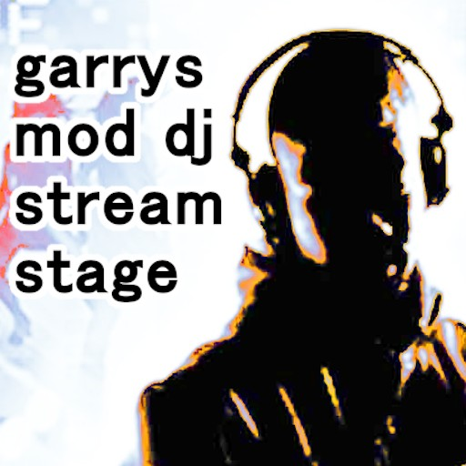

Virtual DJ Gamemode for Garry's Mod
=======================================

This is an add-on for Garry's Mod which introduces a new gamemode and a
few new entities for it as well. This game mode is designed for virtual
DJ sets and things like that.

Its primary intention is to be used in the creation of a virtual-club
environment (with multiple visualizers around the room) for use in on-line DJ
sets but works fine as a general internet radio / visualizer as well.

Primarily, this gamemode allows a DJ to pipe in audio from an Internet
radio. If you are controlling the music on the radio then congratulations:
you're a DJ! Examples of working DJ setups will be listed in `docs/`.

This gamemode also supports the use of an (optional) HTML5 <video>
stream; please be patient as we work out all the bugs!

Starting the Party
------------------

The main entity is the `stream_controller` DJ controller. Simply walk up
to it and press "E".

Features
--------

- Numark Mixtrack Pro DJ controller (the one I use IRL!)
- Audio visualizers for the music stream
- HTML5 video playback kinda supported (working with .ogv broadcasts)

Contributing / Source Code
--------------------------

All development of this add-on is done on [the Github page for this
project](https://github.com/yumi-xx/gmod-streamstage)
so all issues / feature requests should be submitted there by creating a new
issue. Pull requests are respected and are actually very helpful in developing
/ maintaining this project.
